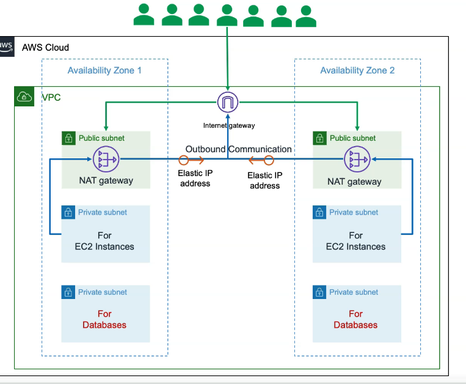

Created a simple  AWS 3 Tier Architecture which has 2 availability zones.
In each availability zone, we'll have a public subnet which the nat gateway would be in, We'll have the private subnet which would be for the EC2 instance and then another private subnet which would be for the Data bases.
